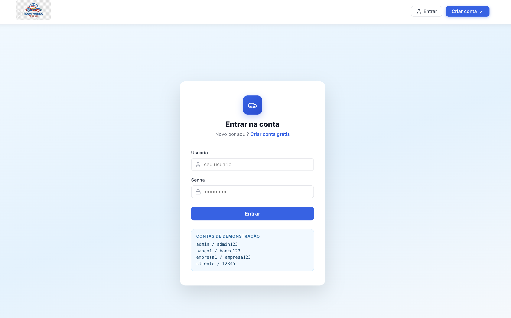
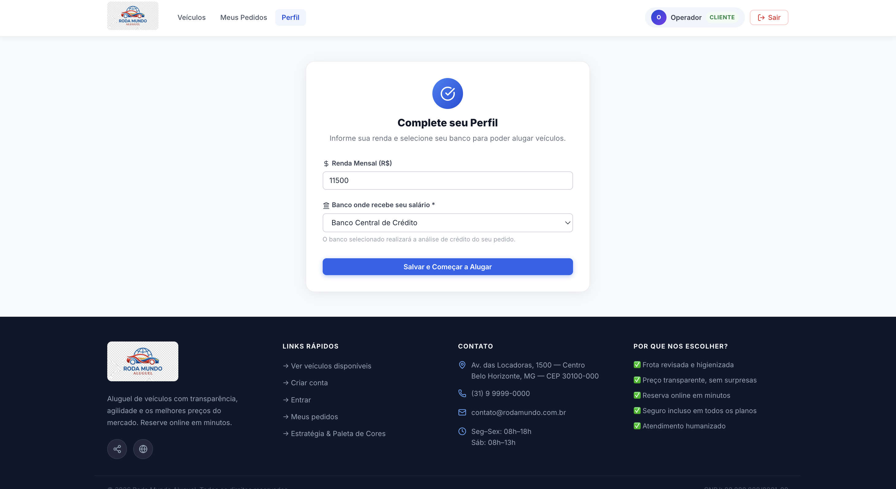
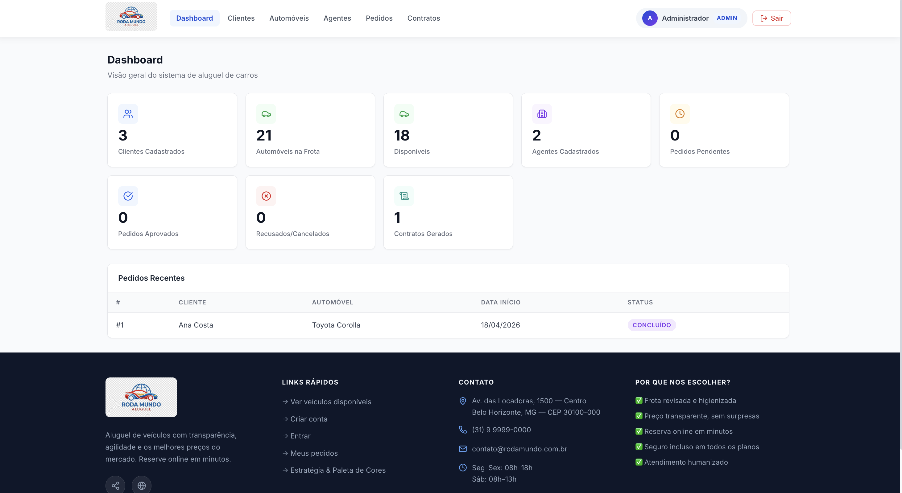
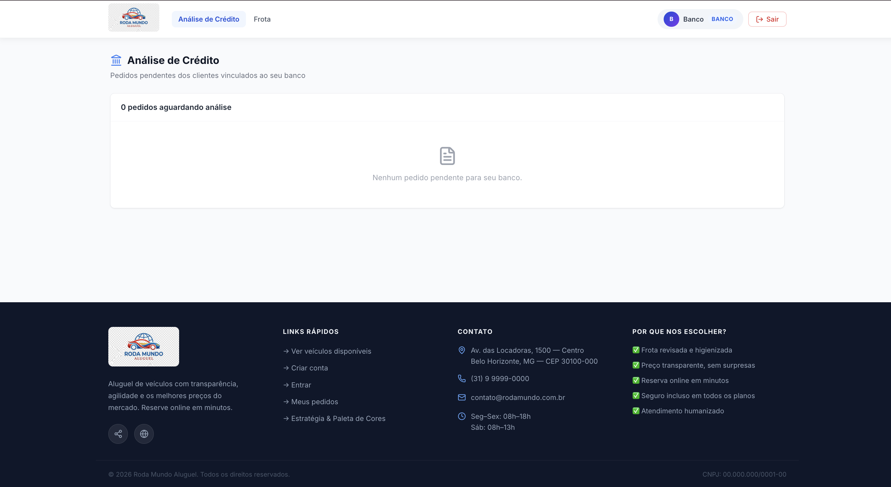
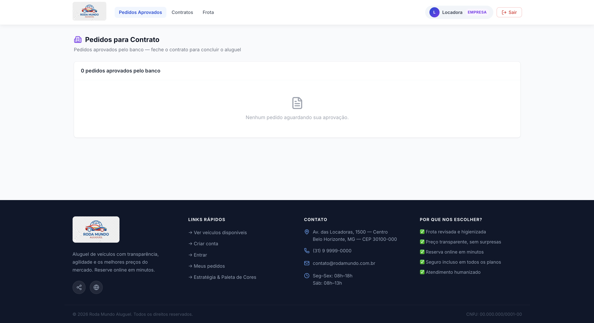
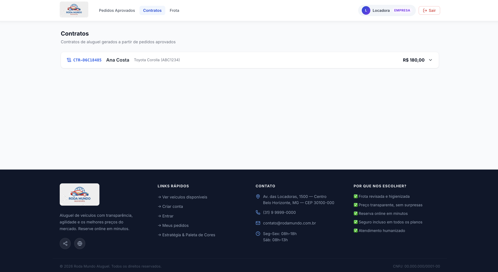

<a href="https://classroom.github.com/online_ide?assignment_repo_id=99999999&assignment_repo_type=AssignmentRepo"></a> <a href="https://classroom.github.com/open-in-codespaces?assignment_repo_id=99999999"></a>

---

# 🚗 Sistema de Aluguel de Carros

> [!NOTE]
> Sistema completo para **gestão de aluguéis de automóveis** — clientes, frota, pedidos, agentes e contratos em uma única plataforma.
> Desenvolvido com **Java 21 + Micronaut 4** no backend e **React 18 + Vite** no frontend, seguindo **Clean Architecture**.

<table>
  <tr>
    <td width="760px">
      <div align="justify">
        O <b>Sistema de Aluguel de Carros</b> é uma aplicação web fullstack desenvolvida para a disciplina de
        <i>Laboratório de Desenvolvimento de Software</i> da <b>PUC Minas — Engenharia de Software (4º Período)</b>.
        A plataforma permite que clientes solicitem aluguéis, empresas gerem contratos após aprovação bancária,
        bancos analisem e aprovem pedidos, e administradores gerenciem todo o fluxo operacional.
        O projeto aplica boas práticas de engenharia de software: <b>Clean Architecture</b>,
        <b>Use Case Pattern</b>, <b>DTOs</b>, <b>Mappers</b>, <b>tratamento global de exceções</b>,
        <b>paginação</b>, <b>autenticação por sessão Bearer</b> e <b>documentação OpenAPI</b>.
      </div>
    </td>
    <td align="center" width="180px">
      
    </td>
  </tr>
</table>

---

## 🚧 Status do Projeto


---

## 📚 Sumário

- [Links Úteis](#-links-úteis)
- [Sobre o Projeto](#-sobre-o-projeto)
- [Funcionalidades](#-funcionalidades)
- [Tecnologias Utilizadas](#-tecnologias-utilizadas)
- [Arquitetura](#-arquitetura)
  - [Visão Geral das Camadas](#visão-geral-das-camadas)
  - [Diagramas UML](#diagramas-uml)
- [Instalação e Execução](#-instalação-e-execução)
  - [Pré-requisitos](#pré-requisitos)
  - [Variáveis de Ambiente](#-variáveis-de-ambiente)
  - [Como Executar](#-como-executar)
  - [Credenciais de Acesso](#credenciais-de-acesso)
  - [Execução com Docker Compose](#-execução-completa-com-docker-compose)
- [Endpoints da API](#-endpoints-da-api)
- [Deploy](#-deploy)
- [Estrutura de Pastas](#-estrutura-de-pastas)
- [Demonstração](#-demonstração)
- [Testes](#-testes)
- [Documentação Utilizada](#-documentação-utilizada)
- [Autores](#-autores)
- [Agradecimentos](#-agradecimentos)
- [Licença](#-licença)

---

## 🔗 Links Úteis

* 📖 **Swagger UI:** [`http://localhost:8080/swagger-ui`](http://localhost:8080/swagger-ui) *(disponível com o backend rodando)*
* 📄 **RapiDoc:** [`http://localhost:8080/rapidoc`](http://localhost:8080/rapidoc)
* 🩺 **Health Check:** [`http://localhost:8080/health`](http://localhost:8080/health)
* 🎨 **Estratégia & Paleta de Cores:** [`http://localhost:5173/estrategia`](http://localhost:5173/estrategia)
* 📋 **Requisitos:** [`docs/requisitos/`](docs/requisitos/)
* 📐 **Diagramas UML:** [`docs/uml/`](docs/uml/)

---

## 📝 Sobre o Projeto

O **Sistema de Aluguel de Carros — Roda Mundo** foi desenvolvido como projeto integrador do curso de **Engenharia de Software — PUC Minas**, com o objetivo de simular um sistema real de gestão de locadoras de veículos.

**Por que existe?**
A gestão manual de aluguéis é propensa a erros, falta de rastreabilidade e processos ineficientes. O sistema centraliza todas as operações — do cadastro ao contrato — em uma plataforma única com controle de papéis e fluxo de aprovação em dois estágios.

**O que resolve?**
- Fluxo de aprovação em **dois estágios**: banco analisa o crédito (PENDENTE → APROVADO_BANCO) e empresa gera o contrato (APROVADO_BANCO → CONCLUIDO)
- Gestão da disponibilidade da frota em tempo real
- Separação clara de responsabilidades por papel: cliente, banco, empresa, admin
- Geração automática de contratos com vínculo bancário

**Contexto:**
Projeto acadêmico desenvolvido ao longo de 3 sprints aplicando metodologias ágeis, modelagem UML, design de API REST e boas práticas de Clean Architecture.

---

## ✨ Funcionalidades

### 🌐 Frontend — Interface Web
- **Landing page pública** — frota com filtros por marca, cor e ano; indicador "Última unidade" por disponibilidade
- **Cadastro com auto-login** — ao criar conta, cliente é redirecionado ao perfil para completar os dados obrigatórios
- **Perfil do cliente** — cadastro de renda mensal e seleção de banco parceiro (obrigatório para criar pedidos)
- **Meus pedidos** — histórico e acompanhamento de status em tempo real
- **Portal do Banco** — visualização e aprovação/rejeição de pedidos PENDENTE do seu banco
- **Portal da Empresa** — visualização de pedidos APROVADO_BANCO e geração de contratos
- **Painel Admin** — dashboard com estatísticas, CRUD de clientes, automóveis, agentes e pedidos
- **Estratégia & Paleta** — página documentando as decisões de UX/marketing com embasamento científico

### 🔧 Backend — API REST
- **Autenticação por sessão Bearer** — login, cadastro com auto-login e logout
- **Fluxo de status controlado** — transições validadas: `PENDENTE → APROVADO_BANCO | REJEITADO | CANCELADO` e `APROVADO_BANCO → CONCLUIDO | REJEITADO`
- **Gestão completa de Clientes** — CRUD com suporte a múltiplos empregadores e banco parceiro vinculado
- **Gestão de Frota** — cadastro de automóveis com controle de disponibilidade automático ao criar/cancelar pedidos
- **Filtros de pedidos por papel** — `?clienteId`, `?bancoId`, `?paraEmpresa=true`
- **Geração de contrato** — calcula dias, valor total e vincula banco automaticamente a partir do pedido
- **Paginação** — endpoints de listagem suportam `?pagina=0&tamanho=20`
- **Swagger UI / RapiDoc** — documentação interativa disponível em `/swagger-ui`
- **Docker Compose** — PostgreSQL + Backend + Frontend com um comando

---

## 🛠 Tecnologias Utilizadas

### 💻 Frontend

| Tecnologia | Versão | Finalidade |
|---|---|---|
| React | 18 | Biblioteca de UI |
| Vite | 6 | Build tool e dev server |
| React Router | 7 | Roteamento SPA com guards por papel |
| Axios | 1.x | Chamadas HTTP com interceptors de auth e 401 |
| Lucide React | 0.x | Biblioteca de ícones |
| React Hot Toast | 2.x | Notificações de feedback |

### 🖥️ Backend

| Tecnologia | Versão | Finalidade |
|---|---|---|
| Java | 21 | Linguagem principal |
| Micronaut | 4.10.10 | Framework web / DI / Data |
| Hibernate JPA | — | ORM / mapeamento relacional |
| Micronaut Serde | — | Serialização JSON |
| H2 | — | Banco em memória (dev) |
| PostgreSQL | 16 | Banco de dados (produção) |
| Gradle | 8.x | Build tool |
| JUnit 5 | — | Framework de testes |
| Mockito | 5.x | Mocking para testes unitários |

### ⚙️ Infraestrutura e DevOps

| Tecnologia | Finalidade |
|---|---|
| Docker | Containerização do backend e frontend |
| Docker Compose | Orquestração dos 3 serviços |
| Nginx | Servidor do frontend em produção + proxy reverso |
| PlantUML | Geração dos diagramas UML |

---

## 🏗 Arquitetura

O projeto segue **Clean Architecture**, com separação estrita entre as camadas de domínio, aplicação e infraestrutura. As regras de negócio ficam nos Use Cases e não dependem de frameworks, banco de dados ou interface gráfica.

### Visão Geral das Camadas

```
[Navegador — React 18 + Vite :5173]
           ↓  HTTP/REST  (proxy Vite em dev / nginx em prod)
[AuthFilter + HttpLoggingFilter]  ← valida Bearer token
           ↓
[Controller]         — Entrada da API REST (:8080)
           ↓
[Use Cases]          — Regras de negócio puras
           ↓
[Mappers]            — Conversão Entity ↔ Domain ↔ DTO
           ↓
[Repositories]       — Interface de acesso a dados
           ↓
[JPA Entities]       — Mapeamento ORM
           ↓
[H2 (dev) / PostgreSQL 16 (prod)]
```

**Pacotes do backend:**

| Pacote | Responsabilidade |
|---|---|
| `controller/` | Endpoints REST, validação de entrada, respostas HTTP |
| `application/auth/` | `AuthService`: sessões em memória, login de clientes, agentes e fixos |
| `application/usecase/` | Casos de uso por módulo — um arquivo por caso de uso |
| `domain/model/` | Enums de domínio (`StatusPedido`, `TipoAgente`) e modelos puros |
| `dto/` | Objetos de transferência de dados (entrada e saída) |
| `infrastructure/mapper/` | Conversão entre camadas (entity ↔ DTO) |
| `infrastructure/persistence/` | Repositórios JPA e entidades |
| `infrastructure/exception/` | `BusinessException`, `ResourceNotFoundException`, handler global |
| `infrastructure/filter/` | `AuthFilter` (token Bearer) + `HttpLoggingFilter` |
| `infrastructure/DataSeeder` | Dados iniciais de demonstração |

**Padrões aplicados:**
- Repository Pattern
- Use Case Pattern (um arquivo por caso de uso)
- DTO Pattern (Request / Response separados)
- Mapper Pattern (conversão explícita entre camadas)
- Filter Chain (auth e logging via `HttpServerFilter`)
- Exception Handler (respostas padronizadas para erros)

### Fluxo de Status do Pedido

```
            ┌─────────────────────────────────────────────────────┐
            │  Banco analisa crédito    Empresa gera contrato      │
            │                                                       │
PENDENTE ──→ APROVADO_BANCO ──────────────────────────────→ CONCLUIDO
    │               │
    ↓               ↓
CANCELADO      REJEITADO
(cliente)   (banco ou empresa)
```

### Diagramas UML

Os diagramas foram centralizados na rota **[`/estrategia`](http://localhost:5173/estrategia)** do próprio frontend — a mesma página que documenta as estratégias de conversão e paleta de cores. A decisão faz sentido porque `/estrategia` já funciona como a **documentação viva do projeto**: reúne as decisões de design (cores, psicologia, UX) e a arquitetura técnica (UML) em um único endpoint público, sem precisar de ferramentas externas.

| Diagrama | Arquivo fonte `.puml` | PNG servido em |
|---|---|---|
| Casos de Uso | [`docs/uml/casos-de-uso/caso-de-uso-v3.puml`](docs/uml/casos-de-uso/caso-de-uso-v3.puml) | `frontend/public/uml/caso-de-uso-v3.png` |
| Classes | [`docs/uml/classes/classes-v4.puml`](docs/uml/classes/classes-v4.puml) | `frontend/public/uml/classes-v4.png` |
| Componentes | [`docs/uml/componentes/componentes-v4.puml`](docs/uml/componentes/componentes-v4.puml) | `frontend/public/uml/componentes-v4.png` |
| Implantação | [`docs/uml/implantacao/implantacao-v3.puml`](docs/uml/implantacao/implantacao-v3.puml) | `frontend/public/uml/implantacao-v3.png` |
| Pacotes | [`docs/uml/pacotes/pacotes-v3.puml`](docs/uml/pacotes/pacotes-v3.puml) | `frontend/public/uml/pacotes-v3.png` |
| Transição de Estados | [`docs/uml/estados/estados-pedido-v1.puml`](docs/uml/estados/estados-pedido-v1.puml) | `frontend/public/uml/estados-pedido-v1.png` |

> **Para publicar:** exporte cada `.puml` como PNG (VS Code + plugin PlantUML, `Alt+D` → exportar) e salve em **`frontend/public/uml/`**. O Vite serve essa pasta como estático em dev; o Nginx faz o mesmo em produção. Os PNGs em `docs/uml/` são o artefato versionado — os em `frontend/public/uml/` são o que aparece no site.


---

## 🔧 Instalação e Execução

### Pré-requisitos

| Ferramenta | Versão mínima | Verificar com |
|---|---|---|
| Java JDK | 21 | `java --version` |
| Node.js | 18 LTS | `node --version` |
| npm | 9+ | `npm --version` |
| Docker Desktop | Qualquer | Opcional — para produção |
| Git | Qualquer | `git --version` |

---

### 🔑 Variáveis de Ambiente

#### Backend

Nenhuma configuração manual para modo dev — o H2 é iniciado automaticamente.

Para produção (PostgreSQL), configure:

| Variável | Descrição | Padrão |
|---|---|---|
| `MICRONAUT_ENVIRONMENTS` | Ativa perfil de produção | `prod` |
| `DB_URL` | URL JDBC do PostgreSQL | `jdbc:postgresql://postgres:5432/aluguel_carros` |
| `DB_USER` | Usuário do banco | `postgres` |
| `DB_PASSWORD` | Senha do banco | `postgres` |

#### Frontend

```bash
cp frontend/.env.example frontend/.env.local
```

| Variável | Descrição | Padrão |
|---|---|---|
| `VITE_API_URL` | URL base da API | `http://localhost:8080` |

#### Docker Compose

```bash
cp .env.example .env
```

---

### ⚡ Como Executar

Execute em **dois terminais separados**:

#### Terminal 1 — Backend (porta 8080)

```bash
cd backend

# macOS (Homebrew):
export JAVA_HOME=/opt/homebrew/opt/openjdk@21

./gradlew run
```

O banco H2 é criado em memória automaticamente. O **DataSeeder** povoa:
- **1 banco agente:** `banco1 / banco123` (Banco Central de Crédito)
- **1 empresa agente:** `empresa1 / empresa123` (Locadora Rápida S.A.)
- **3 clientes** vinculados ao banco, com pedidos de demonstração
- **5 automóveis** na frota

#### Terminal 2 — Frontend (porta 5173)

```bash
cd frontend
npm install   # apenas na primeira vez
npm run dev
```

Acesse: **[http://localhost:5173](http://localhost:5173)**

---

### Credenciais de Acesso

| Usuário | Senha | Papel | Portal |
|---|---|---|---|
| `admin` | `admin123` | Administrador | Dashboard completo — CRUD de tudo |
| `agente` | `agente123` | Agente Locadora | Dashboard + pedidos + contratos (sem CRUD de agentes) |
| `banco1` | `banco123` | Banco | Análise de crédito — aprova/rejeita pedidos PENDENTE |
| `empresa1` | `empresa123` | Empresa | Portal empresa — gera contratos para APROVADO_BANCO |
| `cliente` | `12345` | Cliente | Frota + meus pedidos + perfil |


---

### 🐳 Execução Completa com Docker Compose

```bash
# Na raiz do projeto:
docker compose up --build

# Verificar containers:
docker ps

# Encerrar:
docker compose down
```

| Serviço | URL |
|---|---|
| Frontend | [http://localhost](http://localhost) |
| API | [http://localhost:8080](http://localhost:8080) |
| Swagger UI | [http://localhost:8080/swagger-ui](http://localhost:8080/swagger-ui) |

---

## 🔌 Endpoints da API

Documentação interativa completa em `/swagger-ui` com o backend rodando.

### Autenticação — `/auth`

| Método | Endpoint | Descrição | Auth? |
|---|---|---|---|
| POST | `/auth/login` | Login — retorna token Bearer | Não |
| POST | `/auth/cadastro` | Cadastro de cliente com auto-login | Não |
| POST | `/auth/logout` | Invalida a sessão | Sim |

```bash
# Login
curl -X POST http://localhost:8080/auth/login \
  -H 'Content-Type: application/json' \
  -d '{"usuario": "admin", "senha": "admin123"}'
```

```json
{
  "token": "550e8400-e29b-41d4-a716-446655440000",
  "usuario": "admin",
  "nome": "Administrador",
  "role": "admin"
}
```

Nas demais chamadas:
```
Authorization: Bearer <token>
```

### Clientes — `/clientes`

| Método | Endpoint | Descrição |
|---|---|---|
| POST | `/clientes` | Cadastra cliente |
| GET | `/clientes?pagina=0&tamanho=20` | Lista paginado |
| GET | `/clientes/{id}` | Busca por ID |
| PUT | `/clientes/{id}` | Atualiza (renda, banco, etc.) |
| DELETE | `/clientes/{id}` | Remove |

### Automóveis — `/automoveis`

| Método | Endpoint | Descrição |
|---|---|---|
| POST | `/automoveis` | Cadastra automóvel |
| GET | `/automoveis` | Lista todos (público) |
| GET | `/automoveis?disponivel=true` | Lista disponíveis |
| GET | `/automoveis/{id}` | Busca por ID |
| PUT | `/automoveis/{id}` | Atualiza |
| DELETE | `/automoveis/{id}` | Remove |

### Pedidos — `/pedidos`

| Método | Endpoint | Descrição |
|---|---|---|
| POST | `/pedidos` | Cria pedido |
| GET | `/pedidos?pagina=0&tamanho=20` | Lista todos (admin) |
| GET | `/pedidos?clienteId=1` | Pedidos do cliente (portal cliente) |
| GET | `/pedidos?bancoId=1` | Pedidos PENDENTE do banco (portal banco) |
| GET | `/pedidos?paraEmpresa=true` | Pedidos APROVADO_BANCO (portal empresa) |
| GET | `/pedidos/{id}` | Busca por ID |
| PATCH | `/pedidos/{id}/status` | Banco aprova/rejeita; empresa rejeita |
| PATCH | `/pedidos/{id}/cancelar` | Cliente cancela pedido PENDENTE |

**Fluxo de status:**

```
PENDENTE ──→ APROVADO_BANCO ──→ CONCLUIDO
    │               │
    ↓               ↓
CANCELADO       REJEITADO
```

### Agentes — `/agentes`

| Método | Endpoint | Descrição |
|---|---|---|
| POST | `/agentes` | Cadastra agente |
| GET | `/agentes` | Lista todos |
| GET | `/agentes?tipo=BANCO` | Filtra por tipo (BANCO ou EMPRESA) |
| GET | `/agentes/{id}` | Busca por ID |
| PUT | `/agentes/{id}` | Atualiza |
| DELETE | `/agentes/{id}` | Remove |

### Contratos — `/contratos`

| Método | Endpoint | Descrição |
|---|---|---|
| GET | `/contratos` | Lista todos os contratos |
| GET | `/contratos/pedido/{pedidoId}` | Busca contrato por pedido |
| POST | `/contratos/pedido/{pedidoId}/gerar?empresaId=1` | Gera contrato para pedido APROVADO_BANCO |

---

## 🚀 Deploy

### Build dos artefatos

```bash
# Frontend — gera /frontend/dist
cd frontend && npm run build

# Backend — gera shadow JAR em /backend/build/libs/
cd backend && ./gradlew shadowJar
```

### Produção com Docker Compose

```bash
docker compose up --build -d

# Ver logs do backend:
docker logs aluguel-carros-api -f

# Encerrar:
docker compose down
```

```bash
# .env na raiz do projeto
DB_USER=postgres
DB_PASSWORD=sua-senha-segura
```

---

## 📂 Estrutura de Pastas

```
sistema-aluguel-carros/
├── .env.example                   # Variáveis Docker (DB_USER, DB_PASSWORD)
├── docker-compose.yml             # Orquestração: postgres + backend + frontend
├── README.md
│
├── backend/                       # Java 21 + Micronaut 4
│   ├── Dockerfile
│   ├── build.gradle
│   └── src/
│       ├── main/
│       │   ├── java/com/gustavofirmino/aluguelcarros/
│       │   │   ├── Application.java
│       │   │   ├── application/
│       │   │   │   ├── auth/
│       │   │   │   │   └── AuthService.java       ← sessões em memória, 3 estágios de login
│       │   │   │   └── usecase/
│       │   │   │       ├── agente/
│       │   │   │       ├── automovel/
│       │   │   │       ├── cliente/
│       │   │   │       ├── contrato/              ← GerarContratoUseCase (principal)
│       │   │   │       └── pedido/
│       │   │   ├── controller/
│       │   │   │   ├── AuthController.java        ← /auth/login · /cadastro · /logout
│       │   │   │   ├── ClienteController.java
│       │   │   │   ├── AutomovelController.java
│       │   │   │   ├── PedidoController.java      ← filtros: clienteId · bancoId · paraEmpresa
│       │   │   │   ├── AgenteController.java
│       │   │   │   └── ContratoController.java
│       │   │   ├── domain/model/
│       │   │   │   ├── StatusPedido.java          ← PENDENTE · APROVADO_BANCO · CONCLUIDO ...
│       │   │   │   └── TipoAgente.java            ← BANCO · EMPRESA
│       │   │   ├── dto/
│       │   │   │   ├── auth/                      ← AuthRequestDTO · CadastroRequestDTO · AuthResponseDTO
│       │   │   │   ├── cliente/ agente/ automovel/ pedido/ contrato/
│       │   │   │   └── PageDTO.java
│       │   │   └── infrastructure/
│       │   │       ├── exception/
│       │   │       ├── filter/
│       │   │       │   ├── AuthFilter.java        ← valida Bearer em todas as rotas
│       │   │       │   └── HttpLoggingFilter.java
│       │   │       ├── mapper/
│       │   │       ├── persistence/
│       │   │       │   ├── entity/                ← ClienteEntity (rendaMensal + bancoAgente FK)
│       │   │       │   └── repository/            ← AgenteRepository.findByLogin()
│       │   │       └── DataSeeder.java            ← 1 banco · 1 empresa · 3 clientes · 5 carros
│       │   └── resources/
│       │       ├── application.properties
│       │       ├── application-dev.properties     ← H2 in-memory
│       │       └── application-prod.properties    ← PostgreSQL via env vars
│       └── test/
│           └── java/.../usecase/pedido/
│               ├── AtualizarStatusPedidoUseCaseTest.java
│               ├── CriarPedidoUseCaseTest.java
│               └── CancelarPedidoUseCaseTest.java
│
├── frontend/                      # React 18 + Vite
│   ├── .env.example               ← VITE_API_URL
│   ├── Dockerfile
│   ├── nginx.conf
│   ├── public/
│   │   └── images/
│   │       └── logo.jpeg          ← logo da Roda Mundo
│   └── src/
│       ├── App.jsx                ← Router + guards por papel + layout unificado
│       ├── index.css              ← design system + media queries responsivas
│       ├── components/
│       │   ├── Navbar.jsx         ← nav links dinâmicos por papel + badge de role
│       │   ├── Footer.jsx         ← links rápidos + contato + /estrategia
│       │   ├── Carousel.jsx       ← hero rotativo da landing
│       │   ├── Sidebar.jsx        ← legado (não usado no layout atual)
│       │   └── pedido/
│       │       ├── NovoPedidoModal.jsx
│       │       └── PedidoDetailModal.jsx
│       ├── hooks/
│       │   └── useAuth.js
│       ├── pages/
│       │   ├── HomePage.jsx       ← frota pública + prova social + "como funciona"
│       │   ├── Login.jsx
│       │   ├── Cadastro.jsx       ← auto-login → redirect /perfil
│       │   ├── Perfil.jsx         ← renda + banco parceiro (obrigatório para pedidos)
│       │   ├── MeusPedidos.jsx
│       │   ├── Dashboard.jsx
│       │   ├── Clientes.jsx
│       │   ├── Automoveis.jsx
│       │   ├── Agentes.jsx
│       │   ├── Pedidos.jsx
│       │   ├── Contratos.jsx
│       │   ├── PedidosBanco.jsx   ← portal banco: aprovar / rejeitar PENDENTE
│       │   ├── PedidosEmpresa.jsx ← portal empresa: gerar contrato APROVADO_BANCO
│       │   └── Estrategia.jsx     ← pesquisa de cores + estratégias de conversão
│       └── services/
│           └── api.js             ← Axios + interceptors auth/401
│
└── docs/
    ├── logo.png                   ← logo para o README (adicionar)
    ├── screenshots/               ← capturas de tela (adicionar)
    │   ├── homepage.png
    │   ├── login.png
    │   ├── perfil.png
    │   ├── dashboard.png
    │   ├── pedidos.png
    │   ├── pedido-detalhe.png
    │   ├── portal-banco.png
    │   ├── portal-empresa.png
    │   ├── automoveis.png
    │   └── contratos.png
    ├── requisitos/
    │   ├── historias-de-usuario.md
    │   └── regras-de-negocio.md
    └── uml/
        ├── casos-de-uso/          ← caso-de-uso-v3.puml → gerar v3.png
        ├── classes/               ← classes-v4.puml → gerar v4.png
        ├── componentes/           ← componentes-v4.puml → gerar v4.png
        ├── implantacao/           ← implantacao-v3.puml → gerar v3.png
        └── pacotes/               ← pacotes-v3.puml → gerar v3.png
```

---

## 🎥 Demonstração

### 🌐 Aplicação Web

| Tela | Screenshot |
|:---:|:---:|
| **Homepage — Frota pública** | **Login** |
|  |  |
| **Perfil do cliente** | **Dashboard Admin** |
|  |  |
| **Pedidos — listagem** | **Portal Banco** |
|  |  |
| **Portal Empresa** | **Contratos** |
|  |  |


### 💻 Demonstração da API (cURL)

```bash
# 1. Login e obtenção do token
TOKEN=$(curl -s -X POST http://localhost:8080/auth/login \
  -H 'Content-Type: application/json' \
  -d '{"usuario":"banco1","senha":"banco123"}' | jq -r '.token')

# 2. Listar pedidos pendentes do banco
curl -X GET 'http://localhost:8080/pedidos?bancoId=1' \
  -H "Authorization: Bearer $TOKEN"

# 3. Aprovar pedido
curl -X PATCH 'http://localhost:8080/pedidos/1/status' \
  -H "Authorization: Bearer $TOKEN" \
  -H 'Content-Type: application/json' \
  -d '{"status": "APROVADO_BANCO"}'

# 4. Empresa gera contrato
TOKEN_EMP=$(curl -s -X POST http://localhost:8080/auth/login \
  -H 'Content-Type: application/json' \
  -d '{"usuario":"empresa1","senha":"empresa123"}' | jq -r '.token')

curl -X POST 'http://localhost:8080/contratos/pedido/1/gerar?empresaId=2' \
  -H "Authorization: Bearer $TOKEN_EMP"
```

---

## 🧪 Testes

### Testes Unitários (JUnit 5 + Mockito)

```bash
cd backend
./gradlew test

# Relatório HTML:
open backend/build/reports/tests/test/index.html
```

| Classe de Teste | Casos cobertos |
|---|---|
| `AtualizarStatusPedidoUseCaseTest` | Transições válidas (PENDENTE→APROVADO_BANCO, PENDENTE→REJEITADO, APROVADO_BANCO→REJEITADO), transição inválida, liberação de automóvel, pedido inexistente |
| `CriarPedidoUseCaseTest` | Criação com sucesso, datas inválidas, automóvel indisponível, cliente sem banco selecionado |
| `CancelarPedidoUseCaseTest` | Cancelamento com sucesso, status APROVADO_BANCO não cancelável, pedido inexistente |

### Progresso das Sprints

| Sprint | Entregável | Status |
|---|---|---|
| Lab02S01 | Casos de Uso, Histórias de Usuário, Classes, Pacotes | ✅ Concluído |
| Lab02S02 | Revisão de diagramas, Componentes, CRUD de Cliente | ✅ Concluído |
| Lab02S03 | Pedidos · Agentes · Contratos · Frontend completo · Auth · Testes · Docker | ✅ Concluído |

---

## ⚠️ O que você ainda precisa fazer antes de subir no Git

### 📐 1. Gerar os PNGs dos diagramas PlantUML

Os `.puml` estão prontos. Para exportar cada PNG:
1. Abra o arquivo no VS Code com o plugin **PlantUML** instalado
2. Pressione `Alt+D` para abrir o preview
3. `Ctrl+Shift+P` → **PlantUML: Export Current Diagram** → escolha PNG no mesmo diretório

| Arquivo `.puml` | PNG a gerar |
|---|---|
| `docs/uml/casos-de-uso/caso-de-uso-v3.puml` | `caso-de-uso-v3.png` |
| `docs/uml/classes/classes-v4.puml` | `classes-v4.png` |
| `docs/uml/componentes/componentes-v4.puml` | `componentes-v4.png` |
| `docs/uml/implantacao/implantacao-v3.puml` | `implantacao-v3.png` |
| `docs/uml/pacotes/pacotes-v3.puml` | `pacotes-v3.png` |
| `docs/uml/estados/estados-pedido-v1.puml` | `estados-pedido-v1.png` |

> **Alternativa via CLI:** `java -jar plantuml.jar docs/uml/**/*.puml`

### 📸 2. Screenshots da aplicação

Com o sistema rodando (`npm run dev` + `./gradlew run`), tire prints e salve em `docs/screenshots/`:

| Arquivo esperado | Tela |
|---|---|
| `docs/screenshots/homepage.png` | Página inicial com a frota de carros |
| `docs/screenshots/login.png` | Tela de login |
| `docs/screenshots/perfil.png` | Perfil do cliente (com o banner "Passo 2") |
| `docs/screenshots/dashboard.png` | Dashboard do admin |
| `docs/screenshots/pedidos.png` | Lista de pedidos (admin) |
| `docs/screenshots/portal-banco.png` | Portal do banco com pedidos pendentes |
| `docs/screenshots/portal-empresa.png` | Portal da empresa com pedidos aprovados |
| `docs/screenshots/contratos.png` | Listagem de contratos |

### 🖼️ 3. Logo no README

Copie a logo para `docs/logo.png`:
```bash
cp frontend/public/images/logo.jpeg docs/logo.png
```

### 🚫 4. Remover arquivo incorreto antes do commit

O arquivo `backend/package-lock.json` foi gerado por engano (é um projeto Java, não Node). Delete antes de commitar:
```bash
rm backend/package-lock.json
```

### 🚀 5. Commitar e subir

```bash
# Na raiz do projeto
git add .
git reset backend/package-lock.json   # garante que não vai junto

git commit -m "feat: Sprint 3 completo — auth, pedidos, contratos, frontend, Docker, UML v4"

git push origin main
```

---

## 🔗 Documentação Utilizada

* 📖 [Micronaut 4 Documentation](https://docs.micronaut.io/latest/guide/)
* 📖 [Micronaut Data JPA Guide](https://micronaut-projects.github.io/micronaut-data/latest/guide/)
* 📖 [Micronaut OpenAPI](https://micronaut-projects.github.io/micronaut-openapi/latest/guide/)
* 📖 [Jakarta Validation Constraints](https://jakarta.ee/specifications/bean-validation/3.0/)
* 📖 [React 18 Docs](https://react.dev/reference/react)
* 📖 [Vite Configuration Guide](https://vitejs.dev/config/)
* 📖 [React Router v7](https://reactrouter.com/)
* 📖 [Docker Compose Reference](https://docs.docker.com/compose/)
* 📖 [Mockito Documentation](https://site.mockito.org/)
* 📖 [PlantUML Language Reference](https://plantuml.com/guide)
* 📖 [Conventional Commits](https://www.conventionalcommits.org/en/v1.0.0/)

---

## 👥 Autores

| 👤 Nome | 🖼️ Foto | :octocat: GitHub | 💼 LinkedIn |
|---|---|---|---|
| Gustavo Pessoa Firmino Duarte | <div align="center"></div> | <div align="center"><a href="https://github.com/gustavofirmino"></a></div> | <div align="center"><a href="https://www.linkedin.com/in/gustavofirmino"></a></div> |

> **PUC Minas — Engenharia de Software — 4º Período**  
> Laboratório de Desenvolvimento de Software

---

## 🙏 Agradecimentos

* [**PUC Minas — Engenharia de Software**](https://www.pucminas.br/) — Pelo suporte institucional e estrutura acadêmica.
* [**Prof. Dr. João Paulo Aramuni**](https://github.com/joaopauloaramuni) — Pelas orientações em Arquitetura de Software, Design Patterns e Clean Architecture.
* [**Micronaut Framework**](https://micronaut.io/) — Por um framework Java moderno, leve e com DI em tempo de compilação.
* [**Rodrigo Branas**](https://branas.io/) — Pelos conteúdos sobre Clean Architecture e Clean Code.
* [**Código Fonte TV**](https://codigofonte.tv/) — Pelos tutoriais e cobertura da comunidade de desenvolvimento.

---

## 📄 Licença

Este projeto está distribuído sob a licença **MIT**.  
Consulte o arquivo [`LICENSE`](LICENSE) para mais detalhes.

---

<div align="center">
  <sub>Desenvolvido com ☕ Java + ⚛️ React — PUC Minas, 2026</sub>
</div>
